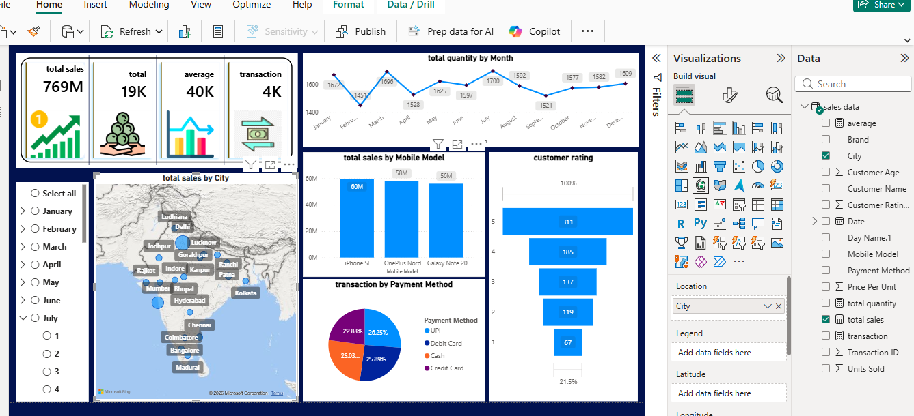
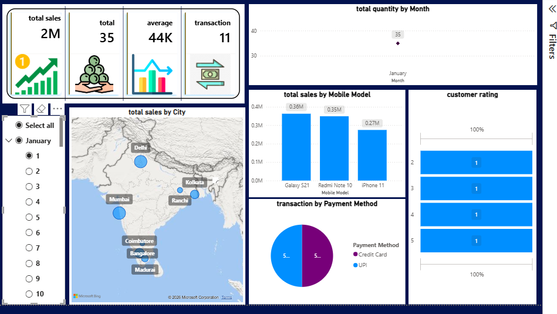

# Data Analyst Portfolio
Complete data analyst portfolio showcasing projects in Power Bi , SQL (PostgreSQL) , Python and Excel . 
## Skills
- Power Bi
- SQL (PostgreSQL)
- Python and (python libraries)
- Excel

## Projects
Details and screenshots will be added for each project.
### Power Bi Project - Sales Dashboard 
Build an interactive sales dashboard in power bi.
KPI cards : Total sales , Total Quantity, Average Sales , Total Transaction .
Monthly sales analysis using month slicer .
Daily sales analysis using date slicer 
Visuals : Line chart, Bar chart, Map chart, Pie chart, Funnel chart.
Payment method and customer rating analysis

** Tools Used : Power bi , Dax, Excel
Screenshots added below 
### Power Bi sales Dashboard 

